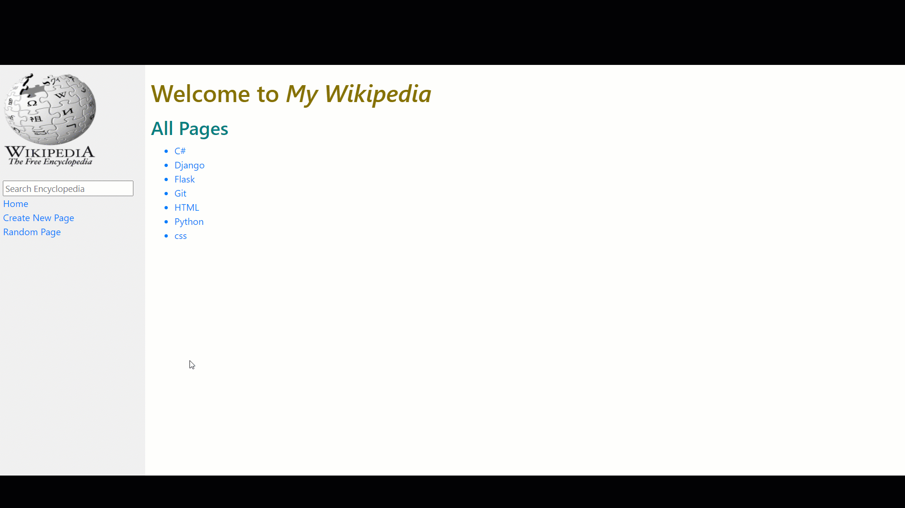
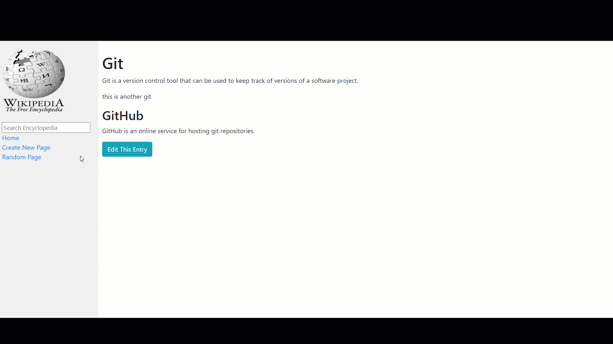
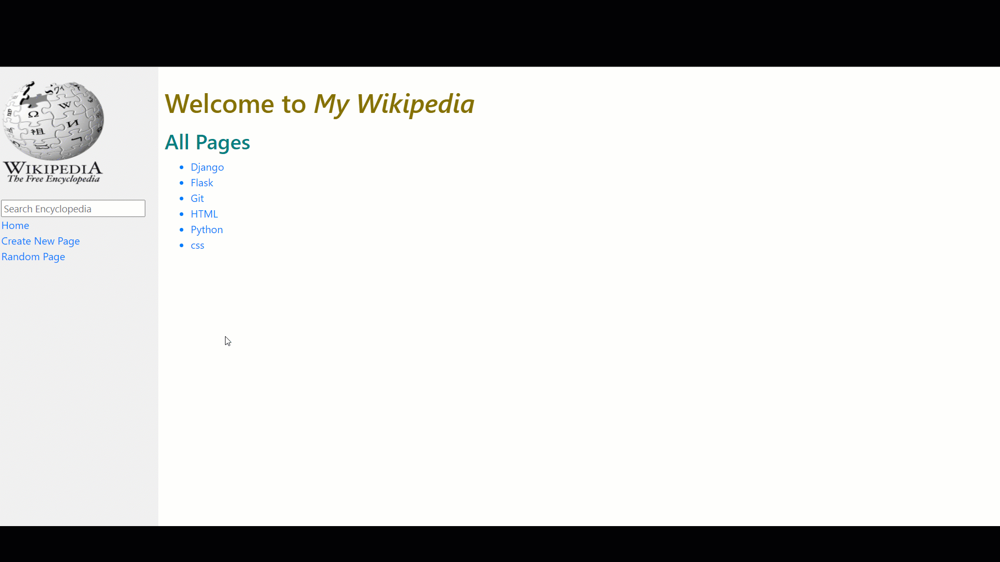
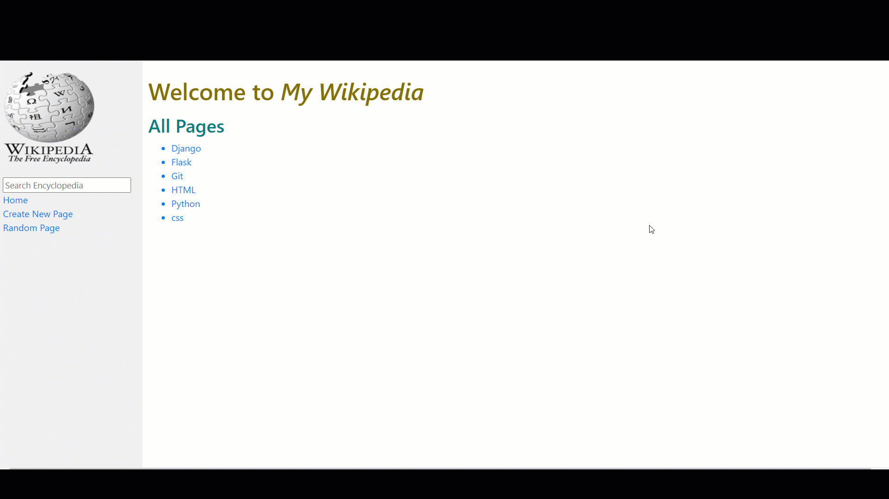

# Wiki
Wiki is Wikipedia-like online encyclopedia.

## Overview
Wiki is the first project for Harvard CS50's Web Programming with Python and JavaScript course. The project specifications are listed [here](https://cs50.harvard.edu/web/2020/projects/1/wiki/).

### Project Demos
A [full demo of my project](https://youtu.be/bUdwRkwpnh8) can be viewed on YouTube along with all [other CS50 Web Projects](https://www.youtube.com/playlist?list=PLFXLIM6hnNVmPzRpnuOI8Og5DBVxKu15_).

Note the quality may be low due to conversion from video to GIF format.  
**Index Page**   

  **Search**   

  **New Page**   

  **Edit Page**   

  **Random Page**   

### Architecture
**Frontend**
- Languages: 
	* HTML
	* CSS
- Main Framework/Libraries:
 	* [Django Templates](https://docs.djangoproject.com/en/3.1/ref/templates/language/)
	* [Bootstrap](https://getbootstrap.com/)

**Backend**
- Language: 
	* Python
- Main Framework/Libraries:
 	* [Django](https://www.djangoproject.com/)

**Database**
- [SQLite](https://www.sqlite.org/index.html)

## Bug Reports and Improvements
If you experience any bugs or see anything that can be improved or added, please feel free to [open an issue](https://github.com/MariyaEA/-Wikipedia-like-online-encyclopedia/issues) here or simply contact me through any of the methods below. Thanks in advance!

Email: mariya2k21@gmail.com  
Linkedin: https://www.linkedin.com/in/mariamawit-alemu/
